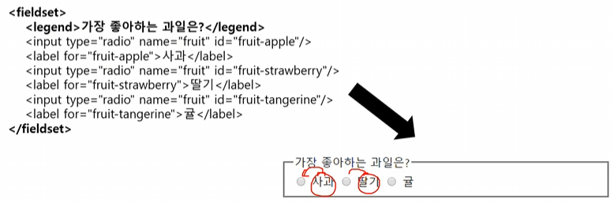

### 강의 내용

- textarea 태그
  - 두 줄 이상의 긴 글을 입력받도록 해주는 입력칸을 만듦
  - 줄바꿈도 가능함
  - 서버에 전송 시, 안의 내용이 그대로 전송됨.
- label 태그
  - 사용자에게 각 입력칸을 설명해주는 레이블을 표시할 수 있음
  - 입력 태그에 id 속성으로 값을 지정하고, 이 값을 label 태그의 for 속성으로 넣어주면 그 입력 태그를 수식해주게 됨.
  - id는 고유의 값이어야 하지만, name은 그룹화 하는 것이기 때문에 여러개 있어도 됨.
  - label은 사람이 보는 이름표, name은 서버가 보기 위한 이름표.
- fieldset, legend 태그
  - 여러 입력 태그를 하나의 그룹으로 묶고 원하는 제목을 달 수 있음
    
