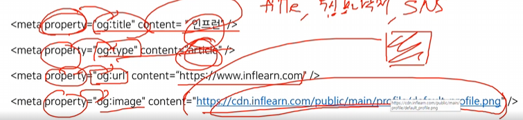

### 강의 내용

- 메타 태그(Meta Tag)
  - 메타태그는 웹 문서의 정보(메타데이터)를 알려주기 위해 작성하는 태그.
    - sns 공유하기 하면 하단에 뜨는 정보들이 메타태그에 의한 메타 정보들임.
    - meta: 근원적인 설명, 추상적인 실체 등을 의미.
  - 사용자에게 보이진 않지만 웹 브라우저, SEO에 도움됨.
  - 메타데이터를 활용하는 웹 서비스들이 사용함
  - head 태그 내에 위치하고, 홀 태그 형식으로 사용 가능.
  - charset='utf-8'도 메타 태그에 들어가는데, 웹 브라우저가 콘텐츠를 어떤 언어셋으로 번역해서 보여줄지에 관한 설정임
- charset
  - 웹 문서의 문자 인코딩을 알려주는 역할.
  - 문자 인코딩이란 웹 문서에 표시되는 문자열이 어떤 문자코드 기반으로 해석되고 표현할지를 정함
  - 현재의 웹에서는 유니코드 기반인 UTF-8 인코딩을 사용함.
  - 기원
    - 예전에는 ascii라는 인코딩 방식을 사용했었는데, 영어만 가능했음 -> 그런데 전 세계로 보급되면서 자체적으로 인코딩 방식을 만들었음 -> 각자 만들다보니 문제가 많았어서 표준화한 것이 utf-8임.
- viewport
  - 웹 문서가 그려지는 영역에 대해 크기나 확대 비율을 어떻게 조정할지 정함
  - content 속성에 viewport 설정값을 넣을 수 있음
  - 주로 모바일 유저를 위해 설정이 필요함.
  - width: 웹 문서가 표현되는 영역의 너비를 결정. 기기에 따른 너비에 맞추려면 device-width라는 값을 사용함
  - initial-scale: 처음 화면에 보일 배율을 결정. 1.0이면 기본 크기이고, 2.0이면 2배 크기가 됨.
  - user-scalable: 유저가 배율 변경 가능하게 할 것인지 여부. yes or no.
  - maximum-scale: 최대 배율 설정.
  - minimum-scale: 최소 배율 설정.
- author, description, keyword
  - 검색엔진이나 외부 웹 서비스에 알려질 정보들을 표현.
  - `<meta name='{author/keyword/description}' content=''>` 처럼 활용됨.
  - 이 내용들이 관련 키워드로 잘 작성되어 있으면 SEO에 도움이 됨.
  - descriptioin은 검색 결과로 보이는 문구이기도 함.
- open graph
  - author, description, keyword 메타 태그로도 정보를 나타낼 수 있지만, open graph 메타 태그를 사용하면 facebook과 같은 sns에 더 자세한 정보를 알려줄 수 있음
    

### 추가 공부

- 메타 데이터가 정확히 뭐지?
- author 랑 og tag랑 다른 점이 뭐지?
